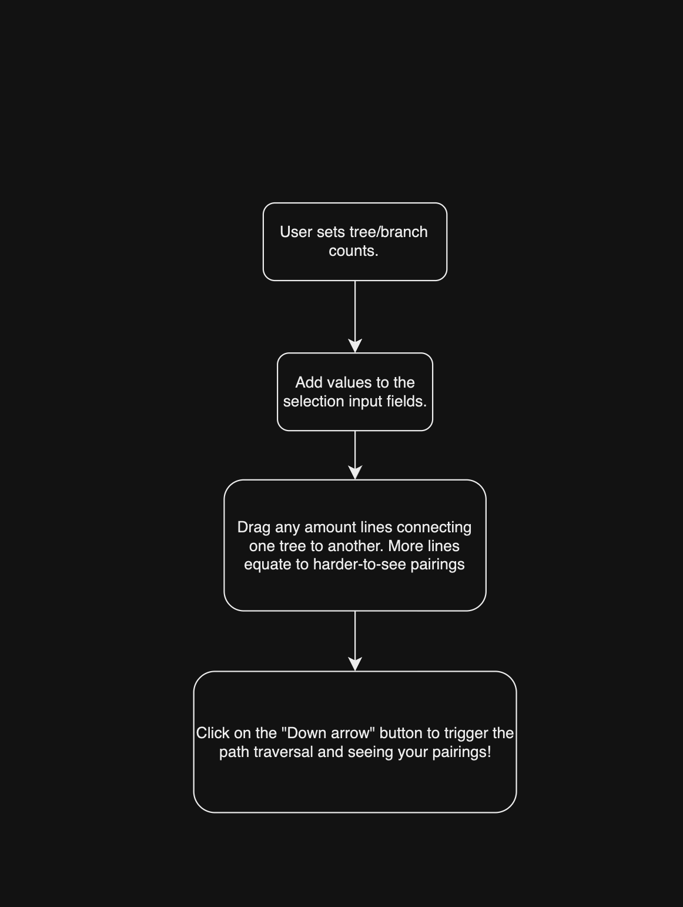

# Ghost Leg | Lottery Randomizer

 Ghost Leg is commonly used in Asia to assign random pairings between selections. The diagrams is initialized with only vertical lines. The user can connect vertical lines to one another. The pairings are then made via path traversal down the connected lines. A common use case is the assignment of tasks to people. 

> [!NOTE]
> Live Demo: https://ghost-leg.netlify.app/

## Usage

1. **Enter subjects** into the input fields.  

2. **Connect vertical lines**: Left-click and drag from one vertical line to another to establish a connection.  

3. **Initiate path traversal**: Once all vertical lines are connected, click the *down arrow* icon to start the process of pairing each subject.

## Workflow Diagram

## Example

## License

Distributed under the [MIT license](https://github.com/houchongchan/Roadmap-Builder/blob/main/LICENSE).
